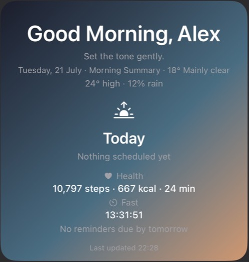
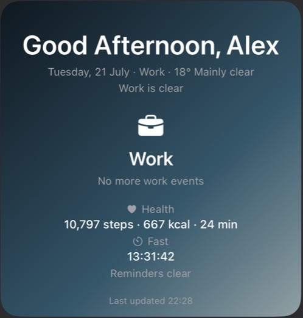
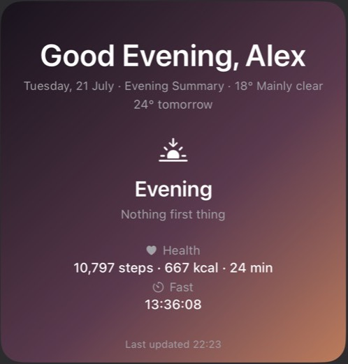
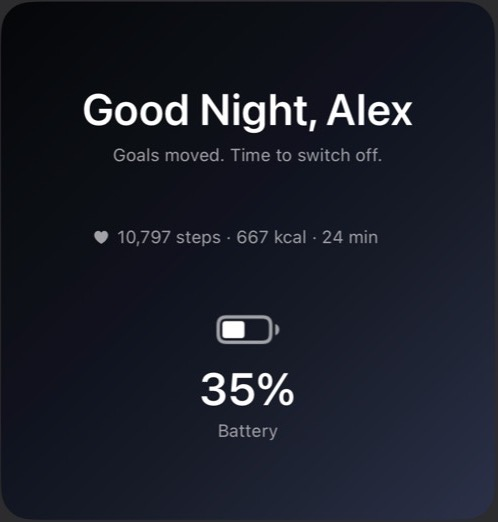

# Pulse

Pulse is a personal large widget for [Scriptable](https://scriptable.app/) on iPhone. It changes through the day, showing a calm morning, work, day-off, evening, or night layout.

It is designed to feel more like an Apple “at a glance” surface than a dense dashboard: one priority, a few quiet signals, and personal context.

## Screenshots

These screenshots use mock data only.

| Morning | Work |
| --- | --- |
|  |  |

| Evening | Night |
| --- | --- |
|  |  |

## What It Shows

- Time-of-day layouts: Morning, Work, Day Off, Evening, Night
- Weather-aware background using a subtle day-cycle glow
- Next event or commute as the central callout
- Health stats from a companion Shortcut
- Live fasting timer
- Work and personal reminder summaries
- Night battery, alarm, event, and encouragement
- Daily rotating morning and night messages

## Requirements

- iPhone with Scriptable installed
- iCloud Drive enabled for Scriptable
- Optional: Apple Shortcuts for Health sync
- Optional: Calendar, Reminders, Location, Weather permissions

## Install

1. Download or copy `Pulse_Scriptable.js`.
2. Open Scriptable.
3. Create a new script.
4. Paste in the contents of `Pulse_Scriptable.js`.
5. Name the script `Pulse`.
6. Add a large Scriptable widget to your Home Screen.
7. Set the widget script to `Pulse`.
8. Run the script once inside Scriptable to open settings and initial setup.

## Health Sync

Pulse reads health data from:

```text
iCloud Drive/Scriptable/pulse-health.json
